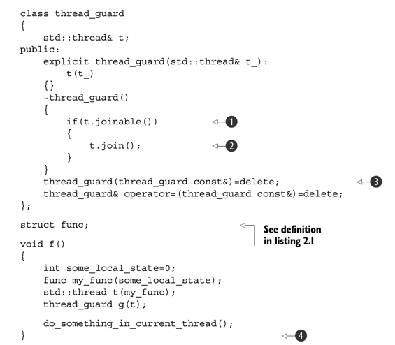
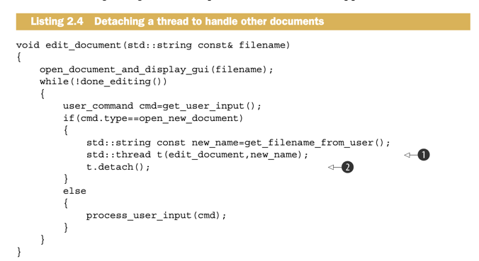
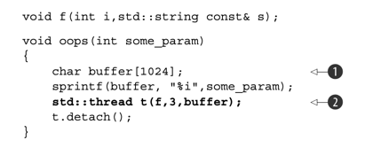
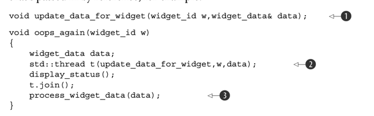
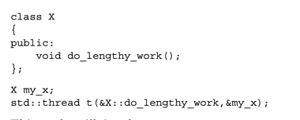
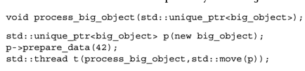
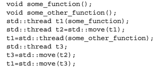
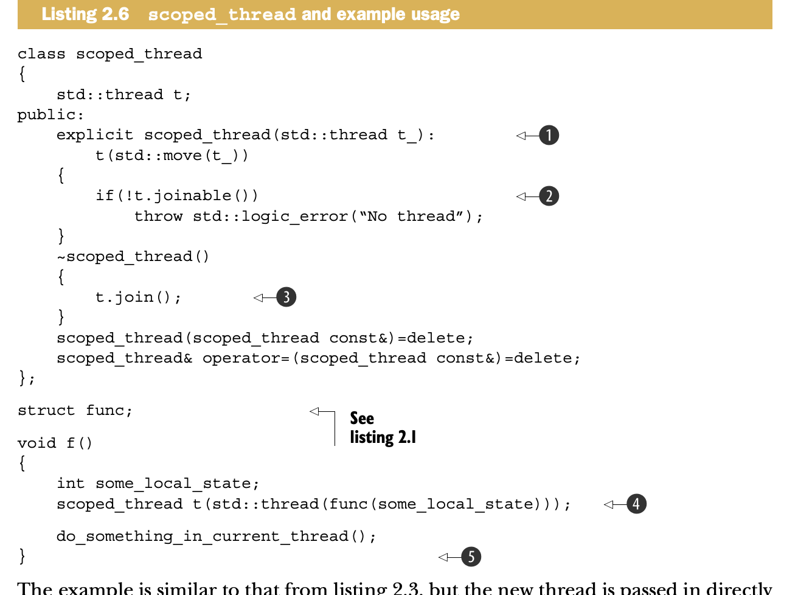
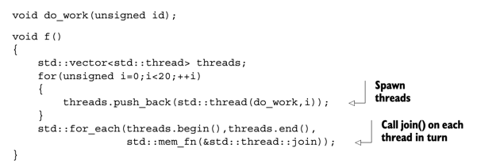
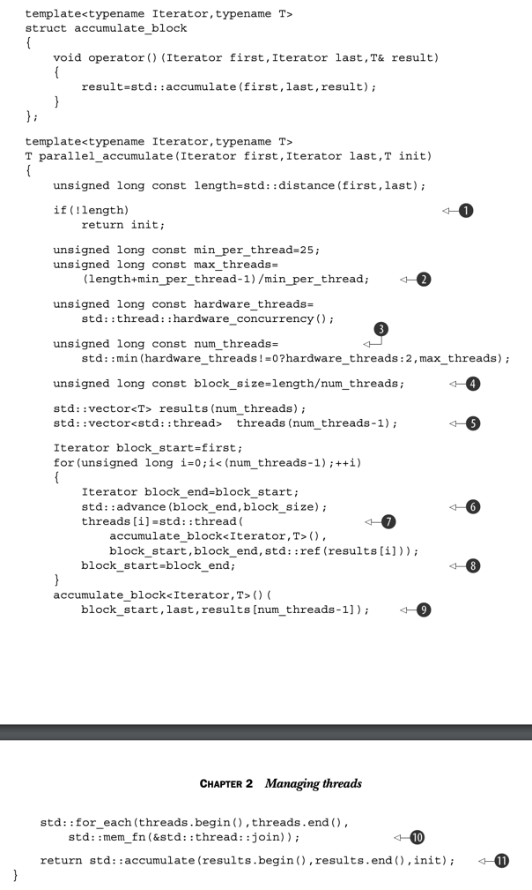

## Managing Threads

### Launching a Thread

```c++ 
void do_some_work(); 
std::thread my_thread(do_some_work); 

class background_task {
public: 
    void operator() () const {
        do_something(); 
        do_something_else(); 
    }
};
background_task f; 
std::thread my_thread(f); 
```

- threads are starting by construcing a `std::thread` object that specifies the fask to run on that thread
- function runs on its own thread until it returns, then the thread stops
- the task could be a function object that takes additional parameters and performs a series of indedenpendt opertaions
  that are specified through some sort of messaging system, and the thread only stops when its signaled to do so
- `std:: thread` works with any callable type, so you cna pass an isntance of a class with a function call operator to
  the
  constructor
- in above case, supplied funtion object is copied into the storage belonging to the newly created threadof exeuction
  and invoked from there
- if you pass a temporary rather than named variable, syntax can be the same as a function delcalration rather than
  object definition

```c++ 
std::thread my_thread(background_task()); 
// decalres a function my_thread that takes a single parameter and returns a std::thread object rather than launching a new thread 

std::thread my_thread((background_task())); 
std::thread my_thred{background_task()}; 
// use extra parenthesis or uniform initialization syntax 

std::thread my_thred([] ( 
    do_something(); 
    do_something_else(); 
}); 

// we cna also use lambda functions 
```

- once we start thread, decide whether to wait for it to finish (join), or let it run on its own (detach)
- if we dont decide before thread is destroyed, then program terminates

```c++
struct func {
    int& i; 
    func(int& i_) : i(i_){} 
    void operator() () {
        for (unsigned j = 0; j < 1000000; ++j) {
            do_something(i); 
        }
    }
};

void oops() {
    int some_local_state = 0; 
    func my_func(some_local_state); 
    std::thread my_thread(my_func);
    my_thread.detach(); 
}
```

- in this case, our thread relies on a local variable `some_local_state`
- if we leave the thread running, local var will be destroyed when function goes out of scope on main thread, thus the
  new thread will access a destroyed var
- one remedy is to make the thread function sef-contained and copy thedata into the thread rather than sharing
- also can ensure has thread has completed executio efore the function exists by joining with the thread

### Waiting for a thread to complete

- if you need to wait for a thread to complete, do this by calling `join()` on associated thread instance
- if we need more fine grained control over checking if a thread has finished, we can use conditoin variables and
  futures(lmao)
- if we are detaching a thread, can call immediately, but for joins we have to be careful, because they can be skipped
  due to exceptions or early returns
- its imporantat to make sure the thead must complete before the function exits, one way to do this is use
  standard Resource Acquisition Is Initialization (RAII) idiom, and provide a class that does the join() in its
  destructor


- in the above, we have a thread guard class that takes in a thread in its constucotr, the thread guard class' destructor automatically joins the thread
- local objects are destroyed in reverse order of construction, first the thread guard, then the thread is joined 
- we use `joinable()` because `join()` can only be called once

### Running threads in the background 
- calling `detach()` on a std::thread object laeves the thread to run in the background, with no direct means of communcating 
- ownership and control are passed over to the c++ runtime library, which ensures resourves associataed with the thread are correctly reclaimed when the thread exists 
- after we call `detach()` the std::thread object is no longer associated with the actual thread of execution, and no longer joinable 
- you can only call `detach()` when `joinable()` returns true
- 
ex) consider word processor that can edit multiple docs 
- multiple top-level windows, one for each document being edited, running within the same instance of application 
- run each window on its own thread, each thread runs the same code, but with different data relating to the document being edited and the corresponding window properties 
- opening a new document therefore requires starting a new thread, thread handling request isnt going to care about waiting for that other thread to finsh because its working on an unrelated document, 
prime candidate for running a detached thread 



### Passing Arguements to a thread function 
- passing arguements to the callable object or function is as simple as passing additional arguements to the constructor 
- by default, the arguements are copied into internal storage, where they can be accessed by the newly created thread of execution, even if corresponding parameter is expecting a reference 


- in the above, f expects `std::string` parameter, but the stirng literal is passed as a char const*, and converted to a std::string only in context of new thread 
- signifivant chance the function will exit before the buffer has bene converted to std::string on new thread
- fix by casting to std::string in the function parameter of the thread 


- reverse can also happen, object is copied but we wanted a reference
- when `update_data_for_widget` is called, it will end up passing a reference to the internal copy of data and not a reference to data itself
- when the thread finishes, these updates will be discarede as the internal copies of the supplied arguements are destroyed, and `process_widget_data` will be passed an unchanged data, rather thana correcctly updated version 
- to fix, wrap arguements that need to be references in `std::ref`
- you can also pass a member function pointer as the function, provided you supply a suitable object pointer as the first arg

- this will incokde `my_x.do_length_work()` on the new thread, because the address of my_x is supplied as the object pointer 


- example using `std::move` to transfer ownership of a dynamic object into a thread 
- ownership of `big_object` is first transferred into internal storage for the newly created thread, and then into `process_big_object` 
- `std::thread` exhibits the same ownership semantics as `std::unique_ptr`, they each own a resource, and each instance is responsible for managing a thread of execution 
- ownership can be transferred between instances, because instances of `std::thread` are movable, this ensures only one object is associated with a particular thread of execution 

## Transferring ownership of a thread 
- suppose we want to write a function that creates a new thread to run in the background but passes back ownership fo the new thread to the calling function rather than waiting for it to complete or reverse,
create a thread and pass ownership in to some function taht should wait for it to complete, either case we need to transfer ownership from one place to another 
- ownership of a particular thread of execution can be moved btwn `std::thread` instances, see below 

- first a new thread is started and associated with `t1`, ownership is transferred to `t2` by invoking `std::move`
- at this pt, `t1` no longer has an associated thread of execution, the thread running `some_function` is now associated with `t2`
- then, a new thread is started and associated with a temporary `std::thread` object, this does not require a call to `std::move` because the owner is a temporary object- moving from temporaries is autoatic and explicit 
- `t3` is default constructed, which menas its created without any associated thread of execution, ownership of the thread currently associated with `t2` is transferred into `t3` with an explicit call to `std::move` because `t2` is a named object 
- after all these moves, `t1` is associated with the thread running `some_other_function`, `t2` has no associated thread, and `t3` is associated with the thread running `some_function` 
- final move transferrs ownership of the thread running `some_function` back to `t1` where is started, but `t1` already has an associate thread (`some_other_function`), so `std::terminate()` is called to terminate the program 


 - one benefit of the move support of `std::thread` is we can build upon the `thread_guard` class and have is actually take ownership of the thread, this avoids the case where the `thread_guard` outlives the thread it was referencing 
 - when the initial thread reaches the end of `f`, the `scoped_thread` object is destroyed and then joins with the thread supplied to the constructor 
 - the move support also allows for containers of `std::thread` objects, if they are move aware like `std::vector` 
 - the code below shows spawning multiple threads and waiting for them to finish 

- if the threads are being used to subdivide the work of an algo, before returning to called, all threads must be finished 
- if `f()` were to return a value to caller that depeneded on the results performed by the operations performed by these threeds, then 
the value would have to be determined by examining the shared data after the threads had terminated 

### Choosing number of threads at runtime 
- `std::thread::hardware_concurreny()`, this function returns the number of threads that can truly run concurrently for a given execution of a program 
- below shows a parallel version of `std::accumulate`, divides the work among threads, with a min number of elements per thread to avoid overhead of too many threads 

- if we have at least one element in the range, divide the number fof elements to process by min block size in order to give max num of threads 
- number of threads to run is the min of the calculated max and number of hardware threads, we dont want to run more threads than the hardware can support (oversubscription), because the 
context switching will mean more thrads will decrease the performance 
- number of entries for each thread to process is the len / num threads 
- we create `std::vector<T>` for the intermediate results and `std::vector<std::thread>` for the threads, we need to launch one fewer than num threads as we already start with 1
- to launch the threads, advacne the `block_end` iterator to the end of the current block and launch a new thread to accumulate the results for this block, start of next block is end of this one 
- once we accumulate results for the last block, you cna wait for all the threads you swapned with `std::for_each`, then add up the results with a final call to `std::accumulate`

### Identifying threads 
- thread identifieers are a type of `std::thread::id` and can be retrieved in 2 ways 
- first the idenfier for a thread can be obtained from its associated `std::thread` object by calling the `get_id()` member function, if it does not have an associated thread of execution, the call to `get_id()` retunrs a default constructed `std::thread::id` object which indicates "not any thread" 
- objects of type `std::thread::id` can be freely copied and companred, if 2 objects are equal, they represent the samet thread, or both are holding the "not any thread" value 
- objects of type `std::thread::id` offer the complete set of comparison operators, which provide a total ordering for all distinct values 
- allows them to be used as keys in associative containers/sorted, or compared in any other way 
- instances of `std::thread::id` are often used to chekc whether a thread needs to perform some operation 
- in the above example, if the threads are used to divide work, the inital thread that launched the others might need to perform its work slightly differently in the middle of the algorithm
- in this case, it could store the reuslt of `std::this_thread::get_id()` before launching the other threads, and then the core part of the algo could check its own threadID against the stored value


- alternatively, the `std::thread::id` of the current thread could be sotred in a data struutre as part of an operation, later opeations on that same ds could then check the storedID against the ID of the thread performing the operatio to determine which operations are permitted/required 
- we can also store threadIDs as keys into associative containers where specific data needs to be associated witha  thread and alternative mechanics such as thread-local storage arent appropraite
- one use case is that the container could be used by a controlling thread to store information about each of the threads under its control 