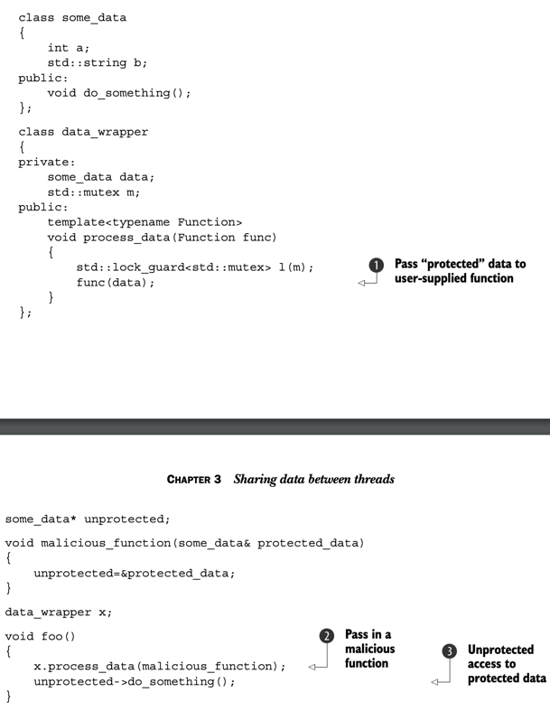
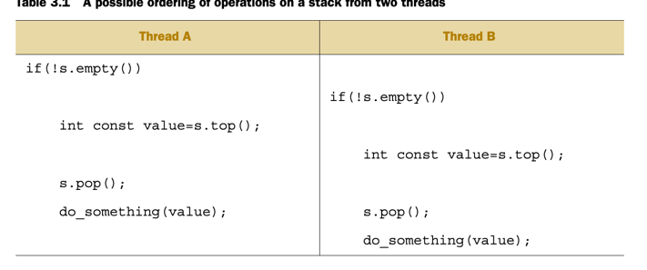
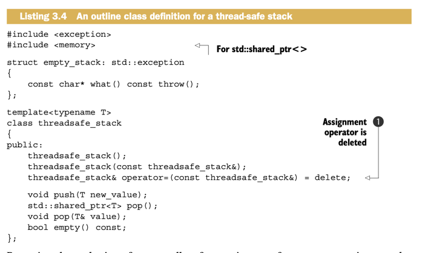
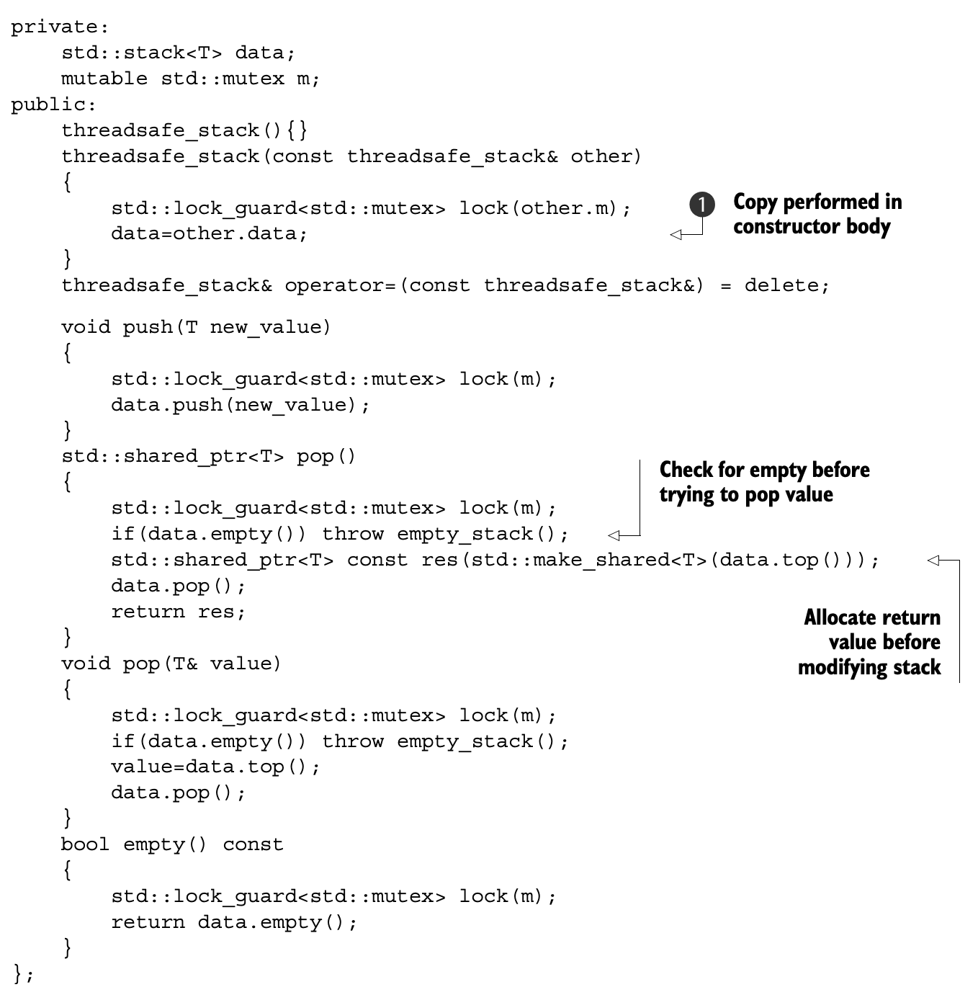
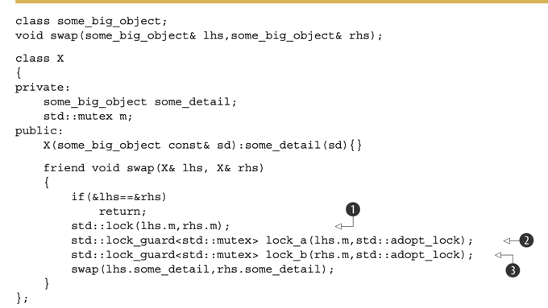
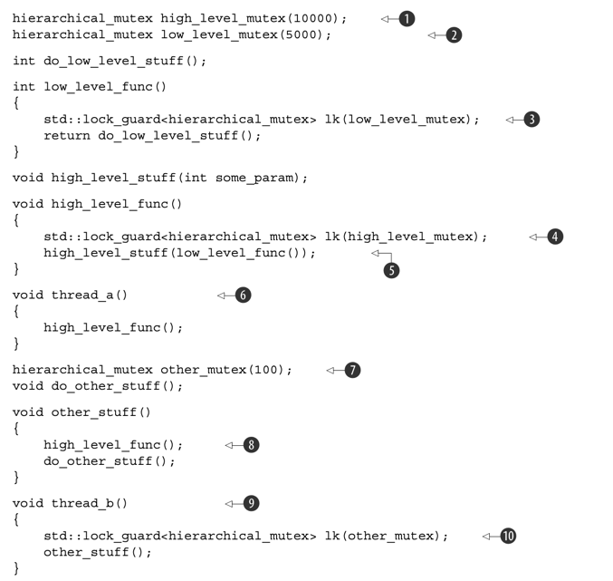
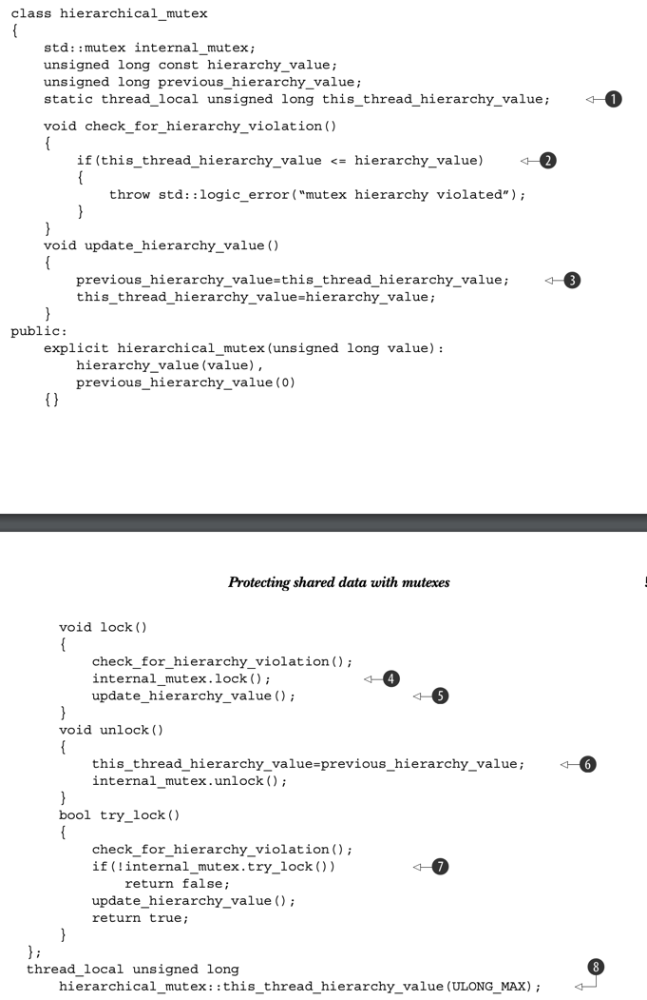
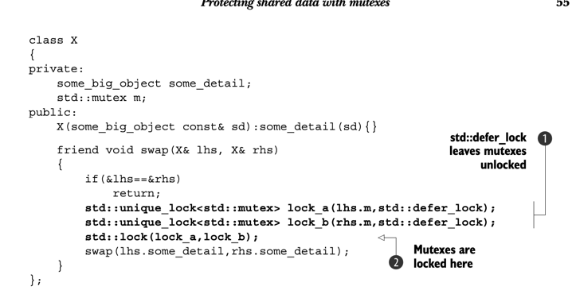

## Sharing data between threads 

### Problems with sharing data bteween threads 
- if data is shared between threads and one or more threads start modifying the same data, there is a lot of potential for trouble 
- one concept thats widel used ot help programmers reason about their code is that of invariants- statements that are always true about a particulat data structure, these ar often broekn during an update 
- for ex, in a doubly linked list, if one thread is reading the list while the other is removing a node, it is possible for the reading thread to see the list with a node only paritally removed thus far 
- this is called a race condition

### Race Conditions 
- in concurrency, a race condition si anything where the outcome depends on the relative ordering of execution of operations on two or more threads, the threads race to perform their respective operations 
- data race - specific type of race condiiton that arisese because of concurrent modification to a single object 

### Avoiding problematic race conditions 
- simplest way to is to wrap data structure with a protection mechanism, to ensure that only the thread performing a modifican can see the intermediate states where the invariants are broken 
- another option is to modify the design of data strucutre and its invarants so that modificiations are done as a series of indivisible changes, each of which perserves the invariants (lock free programming) 
- can also handle updates to the data strucutre a a transaction, the required series of data modifications and reads is stored in a transacition log and then commiteed in a single step 
- if the commit cant proceed because the data strucutre has been modified by another thread, the transaction is restarted
- this is called software transactional memory (STM) 
- most basic mechanism for protecting shared data is `std::mutex` 

### Protecting shared data with mutexes 
- if we have a shared data strucutre such as linked list, and we want to protext it from race condiitons and broken invariants
- we can mark all pieces of code that access the data strucutre as mutually exclusive, so that if any thread was running one of them, any other thread that tried to access the data structure had to wait until the first thread was finished 
- this would make it impossible for a thread to see a broken invarniant except when it was the thread doing the modification 
- this is what a mutex does, before accessing a shared data strucutre, you lock the mutex associated with that data, and when youve finished accessing the data strucutre, you unlock the mutex 
- this ensures taht one one thread has locked a specific mutex, all other threads taht try to lock the same mutex have to wait until the thread that successfully locked the mutex unlocks it 

### Using mutexes in c++ 
- in c++, create mutex by constructing an instance of `std::mutex`, lock with call to `lock()`, and unlock `unlock()` 
- not good practice to call member functions directly, this means you have to remember to call unlcok on every code path out of a function, including those due to exceptions 
- `std::lock_guard`, implements RAII idiom for mutex, locks on construction and unlocks on destruction

- in the above, the use of lock guard in `add_to_lsit()` and `list_contains()` ensures that the `list_contains()`function will never see the list partway through a modificatin by `add_to_list()` 
- common to group mutex and protected data togher ina  clas rather than use global vars, standard OOP practice 
- one hiccup is that if one of the member functions returns a poiter or reference to the protexted data, then any code that has access to that pointer or refernce can now access (and modify) the protexted data without locking the mutex 

### Structuring code for protecting shared data 
- as well as checking that member functions dont pass ptrs or references to callers, important to cehck that they dont pass such ptrs and refs in to functions they call that arent in your control 
- those functions might store the ptr or ref in a place where it can later be used without the protection of the mutex 

- in this example, the code in `process_data` is locked, but the call to the user-supplied function `func` means that foo can pass in `malicious_function` to bypass the protection,
and then call `do_something()` without the mutex being locked 
- what is happening is that we are taking the setting the value of an unprotected data member to the reference of a protected one, when we call the function, this bypasses the mutex in the protected data member
- dont pass pointers and references to protected data outside the scope of the lock, whether by returning them form a function, storing them in externally visible memory, or passing as args to user supplied functions 

### Spotting race conditions inherent in interfaces 
- take for example `std::stack`, problem here is that results of `empty()` and `size()` cant be relied on 
- they might be correct at the time of the call, once theyve retunred, other threads are free to access the stack and might push or pop new elements before the thread that called `empty()` or `size()` could use that information 
- can fix by having `top()` throw an exception, but this makes the call to `empty()` redundant 

- over here is another potential for race condition, between the call to `pop()` and `top()`
- if initially the stack has 2 elements, and is protected by a mutex, only one thread can be running at a time, so the calls get interweaved, while the calls to `do_something()` run concurrently 
- there is nothing between the 2 calls to `top()` to modify the stack, so both threads will see the same value
- therea are also no calls to `top()` between the calls to `pop()`, one of the 2 vallues on ths tack is discarded without ever being read, whereas the other is processed twice 

Options to remedy this: 
1) Pass in a reference to a variable in which you want to recieve the popped vallue as an agurement in the call to pop()
```c++ 
std::vector<int> result; 
some_stack.pop(result); 
```
- works for many cases, but requires the calling code to construct an instance of the stacks value type prior to the call, which is expensive in terms of resources 
- this also assumes the stored type is assignable, but many user-defined types do not support assignment 

2) Require a no throw copy constructor or move constructor 
- theres only an exception safety problem with a value returning pop if the return value can throw an expcetion, many types have copy constructors that dont throw exceptions,
- one option is to restrict the use of the stack to those types that can safely be returned by value without throwing an exception 
- this is safe but not ideal, evne though we can detect at compile time the existence of a copy or move constructor that doesnt throw an exception, it is very limiting 

3) Return a pointer to the popped item 
- advantage here is that pointers can be freely copied without throwing an exception, disadvantage is that returning a ptr requires a means of managing hte memory allocated to the object
- this management is computationally expensive for simple types such as integers, vs just returning the type by value
- prefer to use `std::shared_ptr` to avoid manual mem management 


- the above shows class definition for a stacak with no race conditions, implementing options 1 and 3
- we have 2 overlaods of `pop()`, one that takes a reference to a location in which to store the value, and one that returns a `std::shared_ptr`, simple interface with 2 functions, `push(), pop()` 


- we see here that the copy constructor locks the mutex in the source object and copies the internal stack, you do the copy in the construcotr body rather than member initialization list in order to ensure that the mutex is held across the copy 
- we have to carefully choose how we lock our structure, locking at too small a granuality, the protection doesnt cover the entirety of the desired operation, while locking too large will result in situations where concurreny has no performance benefits as the threads are forced to run one at a time 
- fun fact, the first versions of the linux kernel had a single global kernel lock, but this resulted in a 2 core processor being outperformed by 2 single core processors, 
- there was too much contention for the kernel, so the threads running on additional processors were unable to perform useful work, later versions of the kernel have moved to a more fine grained locking scheme 
- one issue with fine-graied locking schemes is that sometimes you need more than one mutex locked in order to protext the all the data in an operation, we might have to increase the granularity of the data covered by the mutexes, so that only one mutex needs to be locked 
- if we end up having to lock 2 or more mutexed for a given operation, you get a deadlock scenario, where 2 threads are waiting for the other, thus not making any progress

### Deadlock: problem and solution 
- imagine that each of a pairof threds needs to lock both of a pair of mutexes, and each thread has one mutex and is waiting for the other 
- neither thread cna proceed, because each is waiting for the other to release its mutex, this is called a deadlock 
- common advice for avoiding deadlock is to always lock the 2 mutexes in the same order, if you always lock mutex A before mutex B, then you'll never deadlock 
- this is straightforward sometimes, because the mutexes are serving different purposes, but in the case where the mutexes are each protecting a seperate instance of the same class, not so simple 
- for ex) an operation that exchanges data between 2 instances of the same class,, in order to ensure that the data is exchanged correctly, the mutexes on both instances must be locked 
- if a fixed order is chosen (mutex for the instance supplied as the first paramenter, then the mutex for the instance supplied as the second paramter), this can backfire, all it takes is for 2 threads to ty to exchange data between the same 2 instances with the paramters swapped, and you have a deadlock 
- we can use `std::lock` to lock 2 or more mutexes at once without risk of deadlock 

- here we call `std::lock()` to lock the 2 mutexes, and 2 lock guard instances are constructed, one for eah mutex 
- we pass in `std::adopt_lock` as the parameter to the lock guard to indicate that the mutexes are already locked, and thye should just adopt ownership of the exisitng lock on the mutex, rather than attempt to lock the mutex in the constructor 
- this ensures that the mutexes are correctly unlocked on function exit in the general case where the protected operation might throw an exception 
- locking either `lhs.m or rhs.m1` inside the call to `std::lock` can throw an exception, `std::lock` provide all or nothing semantics with regard to locking the supplied mutexes 
- this only helps in cases where you need to acquire 2 or more locks together, if doesnt help if theyre acquired seperately, in that case, its up to the devs(lmao) to ensure you dont get a deadlock 

### Further guidlines for avoiding deadlocks 
- deadlocks can also occur with 2 threds and no locks by having each thread call `join()` on the `std::thread` object for the other, in this case, neither thread can make progress because its waiitng for the other to finish,
- this cycle can occur anywhere that a thred can wait for another thred to perform some action if the other thread can simultaneously be waiting for the first thread, and it isnt limited to 2 threads, a cycle of 3 of more threads will still cause dedlock 
- guidelines for avoiding deadlock all boil down to one idea, dont wait for antoehr thred if theres a chance its waiting for you

1) Avoid nested locks 
- dont aquire a lock if you already hold one, if you stick to this guideline, its impossible to get a deadlock from the lock usage alone becasue each thread only ever holds a single lock 
- still possible to deadlock from other things like the threads waiting for each other, but mutex locks are the most common cause of deadlock

2) Avoid calling user-supplied code while holding a lock 
- because the code is user supplied it could do anything, including acquiring a lock, if you call user-supplied code while holding a lock, and that code acquires a lock, results in nested locks and deadlock 

3) Acquire locks in a fixed order
- if you absolutelymust asquire 2 or more locks, and you cant acquire them as a single operation with `std::lock`, next best thing is to acquire them in the same order in every thread 
- key is to define the order in a way thats consistent btwn threads
- for example, look at the stack from earlier, the mutex is internal to each stack instance, but the operations on the data items stored in a stack require calling user-supplied code
- you can add the constraint taht none of the oeprations on the data items stored in the stack should perform any operation on the stack itself, this puts the burden on the user of the stack
- other cases arent as straightforward, for ex) linked list 
- one possiblity for proteting the list is to have a mutex per node, then in order to access the list, threads must acquire a lock on every node theyre interested in 
- for a thread to delete an item, acquire the lock on 3 nodes, target, next, prev 
- to traverse, thread must keep hold o fthe lock on curr node while it acquires athe lock on the next one in the sequence, to ensure the next ptr isnt modified in the meantime 
- once acquired, the lock on first can be released, called hand over hand locking 
- to avoid deadlocks, the nodes must always be locked in the same order, if 2 threads tried to traverse the list in reverse order using hand over hand locking, deadlocks could occur in the middle of the list 
- if nodes A and B are adjacent in the list, the thread going one way will try to hold the lock on node A and try to acquire the lock on node,B, a thread going the other way would be holding the lock on node B and trying to acquire the lock on node A 
- liekewise, when deleting node B that lies between nodes A and C, if that thred acquires the lock on B before the locks on A and C, it has the potential to deadlock with a thread traversing the list
- the thread would try to lock either A or C first depending on direction of traversal, but would then find that it couldnt obtain a lock on B becaue the thread doing the deleting was holding the lock on B and trying to acquire the locks on A and C 

4) Use a lock heirachy
- provides a means of checking that the convention is adhered to at runtime, the idea is that you divide your application into layers and indentiy all the mutexes that may be locked in any given layer 
- when code tries to lock a mutex, it isnt permitted to lock that mutex if it already holds a lock from a lower layer 
- assign layer numbers to each mutex and keep a record of which mutexes arre locked by each thread 

- `thread_a()` calls `high_level_func()` which locks the `high_level_mutex` and then calls `low_level_func()`, with this mutex locked in order to get the parameter for `high_level_stuff()` 
- `low_level_func()` then locks `low_level_mutex`, which works because this mutex has a lower hierarchy value of 5000 
- `thread_b()` on the other hand, locks the `other_mutex`, which has a hierarchy value of only 100, which means it should be protecting ultra-low-level data 
- when `other_stuff()` calls `high_level_func()`, its violating the hierarhcy, the call to `high_level_func()` will try to arquire the `high_level_mutex`, which has a value of 10000, while the current hierachy value is 100, which will result in an erorr 
- you cannot hold 2 locks at the same time if theyre the same level in the hierarhcy, so hand over hand locking schemes require that each mutex in the chain has a lower hierarchy value than the prior one 


- this shows an implementation of `hierarchical mutex`, can be used with `std::lock_guard` because it implements the three member functions required to satify mutex concept `try_lock(), lock(), unlock()` 
- key here is the use of the `thread_local` value representing the hierarchy value for the current thread, initialized to max val so any mutex can be locked, decalted in `thread_local` so every thread has its own copy
- results in the state of the variable in one thread is entirely independent of the state of the vriable when read from another thread 
- the first time a thread locks in stance of the `hierarchical_mutex`, the value of `this_thread_hierarchy_vaue` is the max val, then delegates the `lock()` to the internal mutex 
- if we lock another `hierachical_mutex`, while holding the lock on the first one, the hierarchy value of the second mutex must be less than the original in order for the check to pass 
- we have to save the prev value of the hierarchy value for the current thread so we can restore it in `unlcok()`, otherwise we woudlnt be able to to lock a mutex with a higher hierarchy value 

### Flexible locking with std::unique_lock 
- `std::unique_lock` provides more flexibilty than `std::lock_guard` by relaxing the invariants, a `std::uniwue_lock` instance doesnt always own the mutex that its associated with
- you can pass `std::adopt_lock` as a second arguement to the constructor to hae the lock object manage the lock on a mutex, you an also pass `std::defer_lcok` as the 2nd arg to indivate that the mutex should remain unlocked on construction 
- the lock can then be acquired later by calling `lock()` on the `std::unique_lock` object, or by passing `std::unique_lock` to `std::lock()` 
- `std::unique_lock` is a fraction slower than `std::lock_guard`, as the flag has to be updated or checked 

- the `std::unique_lock` objects could be passed to `std::lock()` because it provied the necessary member functions `lock(), try_lock(), and unlock()`
- the member functions on the underlying mutex do the actual work, andjust update a flag inside `std::unique_lock` to indicate whether the mutex is currently owned by that instance 
- the flag is necessary in order to ensure that `unlcok()` is called correctly in the destructor 
- if the instance does ownthe mutex, the destructor must call `unlock()`, and if the instance does not own the mutex, it must not call `unlock()` 

### Transferring mutex ownership between scopes 
- because `std::unique_lock` instances dont have their own associated mutexes, the ownership of a mutex can be trasnferred between instances by moving the instances around 
- in some cases the transfer is automatic, such as when returning an instance from a function, and in other cases you have to do it explicitly by calling `std::move()` 
- 