# Building the C++ building blocks for low latency applications 

## Creating and launching a new thread 
- the method below creates a new thread object, sets the thread affinity on the thread, and forwards the function and related args that the thread will run during execution
- this is achieved in the `thread_body` lamda, which is passed to the constructor of `std::thread` 
- after creating the thread, the method waits till the thread either starts running successfully, or fails because it faield to set thread affinity, which is what `t->join()` does 
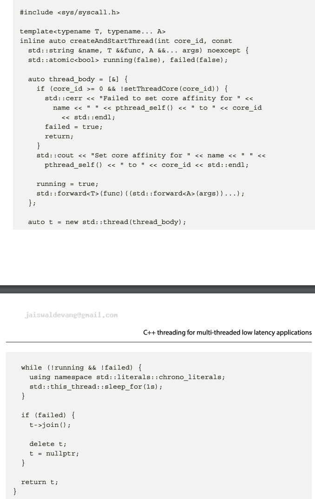

## Setting thread affinity
- if there is a lot of context switching between threads, it adds a lot of overhead to thread performance
- threads jumping between CPU cores also hurts performance for similar reasons, setting thread affinity for performance-critical threads is ery important for similar reasons 
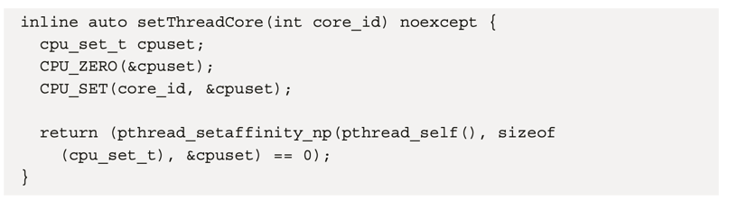
- first we use `cpu_zero()` method to claer the `cpu_set_t` variable, which is an array of flags
- then we use the `cpu_set()` method to enable entry for the `core_id` we are tyring to pin the core to 
- finally, we use `pthread_setaffinity_np()` function to set the thread affinity and return false if that fails 
- use of `pthread_self()` here to get the thread ID, which makes sense because is called from wthin the `std::thread` instance we created
- basically, this function attempts to set the current thread to run on a specific CPU core 

## Designing c++ memory pools to avoid dynamic memory allocations 
- dynamic memory allocation is so slow that low altency applications actively try to avoid it as much as possible on the critical path 

### Understanding the definition of a memory pool_ 
- many applications need t be able to handle many objects, and an unknown number of objects 
- the max number of objects is what can fit inside the systems memory 
- traditional approach to handling these objects is to use dynamic mem allocation, in this case, the heap mem is considered the mem poo
- these are slow and we will control how the allocation and deallocatio of emory happen in our own custom memory pool_ 
- we define a meory pool_ as anything from which we can requrst additional memory or objects and return free meory or objects to
- when the exact number of objects of a certain type that will be required is known ahead of time, you can decide to create exactly that number when needed
- in practice, there are many cases where the exact number is now known 
- the solution we use is to preallocate large block of memory at startup and serve our required amounts at tunetime, that is do the allocationa and dealocation steps ourselves from this storage pool_ 
- this end up performing significantly better for a lot of different reasons, such s being able to limit the me pool_ usage to certain compennts in our ssytem intrad ofa ll processes running on teh server 

## Designing the mem pool_ storage 
- first we need to decide how tos tore the elements inside the pool_ we have 2 choices here 
1) store on stack usig an old-style array (T[N]) or `std::array` 
2) or store on heap using an old-style ptr (T*) or `std::vector`
- depending on the size of the mem pool_ the usage frequency, usage pattenrs, and the application itself, choice depends 
- if we expect a large amt of mem to be used, heap, otherwise stack 
- we will use `std::vector` and heap allocations 
- we need a variable to track which blocks are free or in use, and we need one last variable to track the location of the next free block to quickly serve allocation requests 
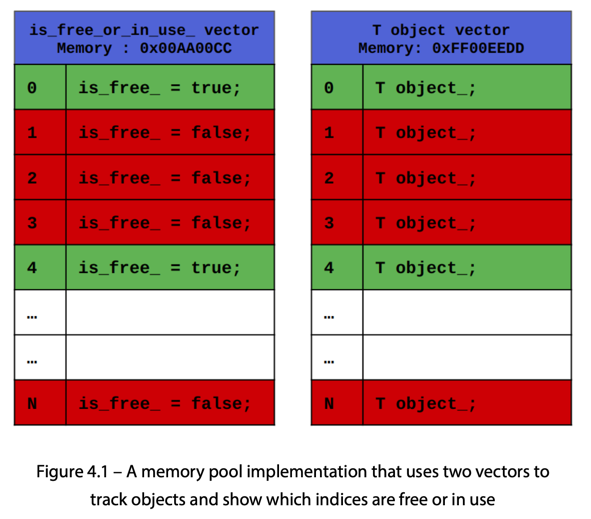
- we use 2 vectors, one to track obects, and one to track the free or empty markets, we assume that these 2 vectors are in different mem locations 
- accessing the free or empty marker and the object itself might cause cahce misses because they are far away from each other
- we maitain a single vector of strucutres (struct, class or primitve object) and each structure sotres both the object and variable to represent the free or empty flag 
- we can simplify this to use one vector with 2 fields, a bool to check whether the space is free, and the object itself 
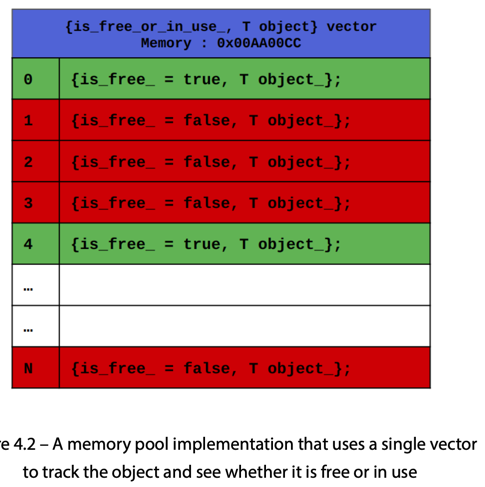
- this is better from a cache performance perspectice, ebcause accessing the object and free marker placed right after the object is btter than accessing 2 diff locations 
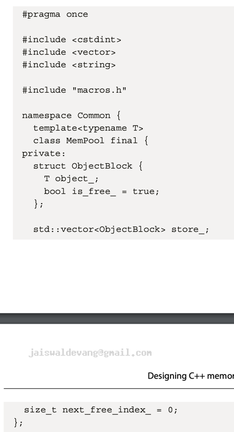

## Initializing the mem pool_ 
- we accept a paremter that specifies the initial size of our mem pool_ and initialize the vector to be large enough to accomodate that many concurrently allocated objects 
- in our design, we will not add functionality to resize the pool_ past initial size
- the initial vector initializaiton is the only time the mem pool_ allocates mem dynamically, so the mem pool_ shold be created before execution of critical path starts
- we add an assertion to make sure the actual object of type T is the first one in the `ObjectBlock` struct 
- we will delete the default constructor, copy constructor, and move constructor methods in order to ensure the methods are not accidentally called

## Serve new allocation requests 
- this is a simple task of finding a block in our storage, which we can do easily using the `next_free_index` tracker 
- then we update the `is_free` market for that blockm initialize the object block of type T using `placement new`, and then update the tracker to point to the next available block 
```
T *ret = &(obj_block->object_);
This line creates a pointer ret of type T* and initializes it with the address of object_ within the obj_block. It's essentially getting a pointer to the memory location where the new object will be constructed.
ret = new(ret) T(args...); // placement new
This line uses placement new to construct a new object of type T at the memory location pointed to by ret. The args... are forwarded to the constructor of T. Placement new allows you to construct an object at a pre-allocated memory location, which is what's happening here. It doesn't allocate new memory; it just calls the constructor for T at the specified location.
```
- for the `updateNextFreeIndex()`, first we have a branch for a cse where the index wraps around the end
- we also add a check to detect and fail if there is ever a case where the mem pool_ is completely full 
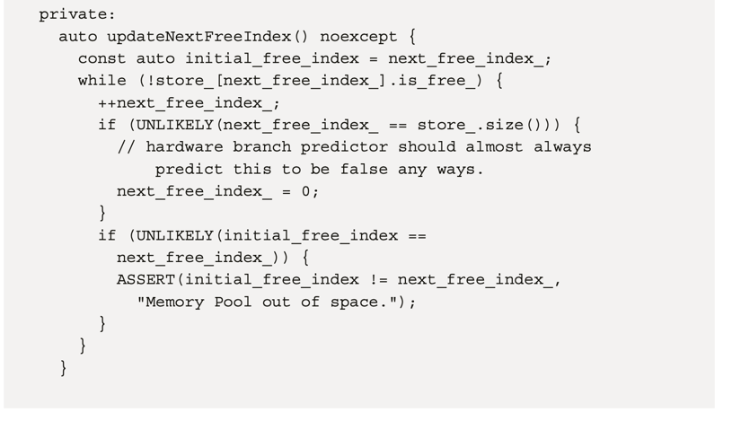

## Handling deallocations 
- dellocating is a simple matter of finding the correct ObjectBlock in our internal storage that corresponds to the object being deallocated, and updating the market for that block to be True 
- to calculate the index, we use reinterpret cast to convert the ptr `elem` to a const `ObjectBlock*` type
- we then subtract the address of the first element of the vector from the converted ptr, result gives us the offset of the elem ptr from beginnig of the vector 

## Using the mem pool_ with an example 
- this created a mem pool_ of a primitve double type and another of a custom struct type, allocates and deallocates some elements form this pool_ and prints out the values and mem locations 
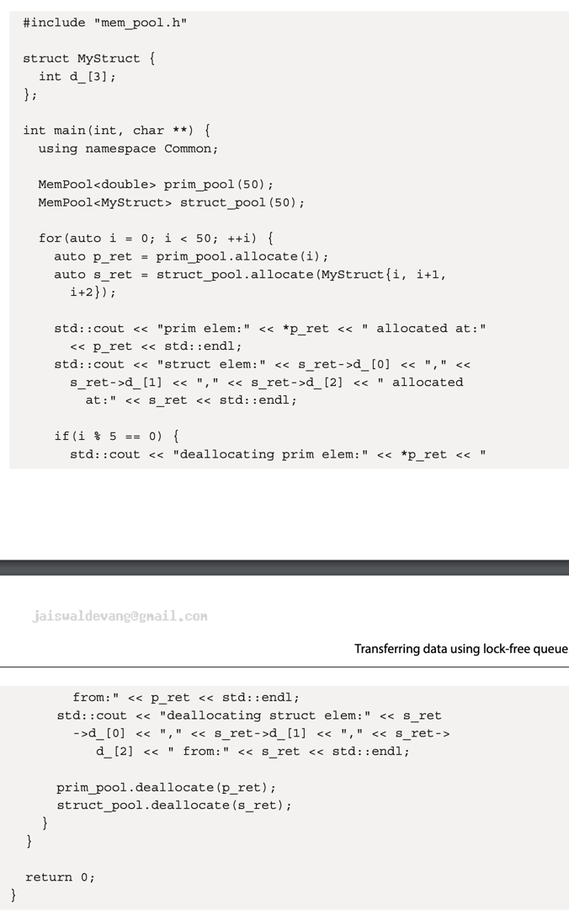

## Transferring data using lock-free queues 
- one possible application of multiple threads is to setup a pipelined system 
- here one component thread performs part of the processing and forwards teh results to the next stage of the pipeline for further processing 

## Designing lock-free queue storage 
- use `std::vector` and allocate mem on the heap 
- 2 `std::atomic` vars, `write_next_index` to track what index the next write to the queue will go to, and `next_read_index` track what index the next unread element in the queue is located in
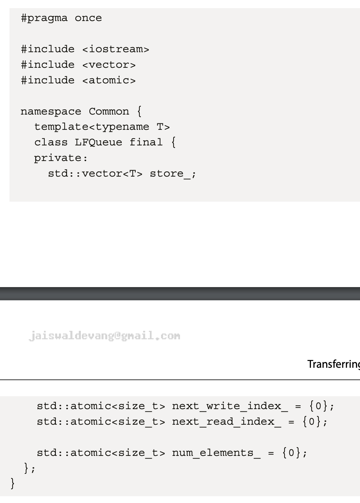
- holds a vector object `store_` of a T template object type, which is the queue, atomics for tracking and num elements

## Initialzing the lock-free queue 
- similar to mem pool_ constructor, dynamically allocate mem for the entire vector in the constructor, and remove copy/move constructors to avoid calling
 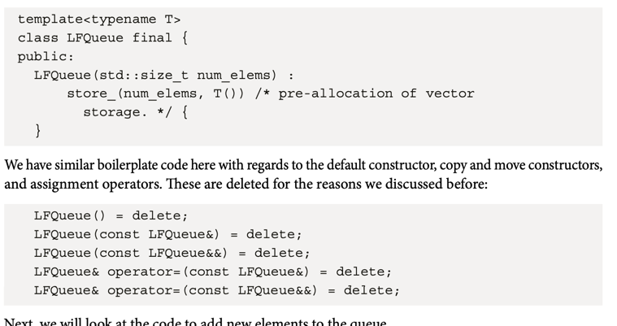

## Adding elements to the queue 
- 2 parts 
1) return a ptr to the next element to write data to 
2) increment the write index once the element has been written, design such that instead of having a single `write()` function, we provide the user with a ptr to the element and if the objects are quite large, then not all of it needs to be updated or overwritten
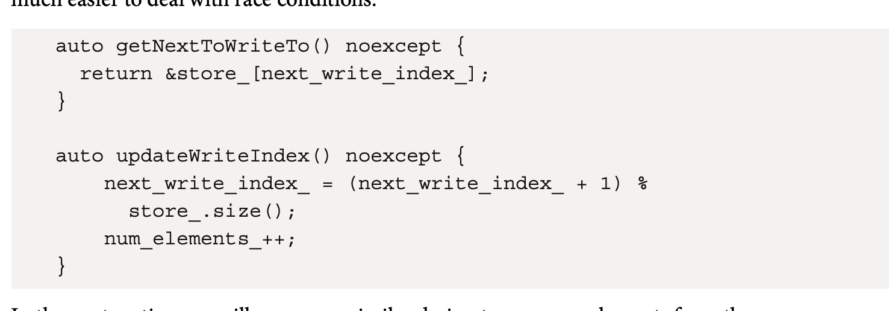

## Consuming elements from the queue 
- again 2 parts, return ptr to next element to be consumed, returns nulptr if there is no element to be consumed, 
- 2nd part updates the read index after the element is consumed
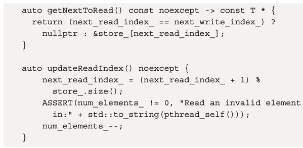
- 